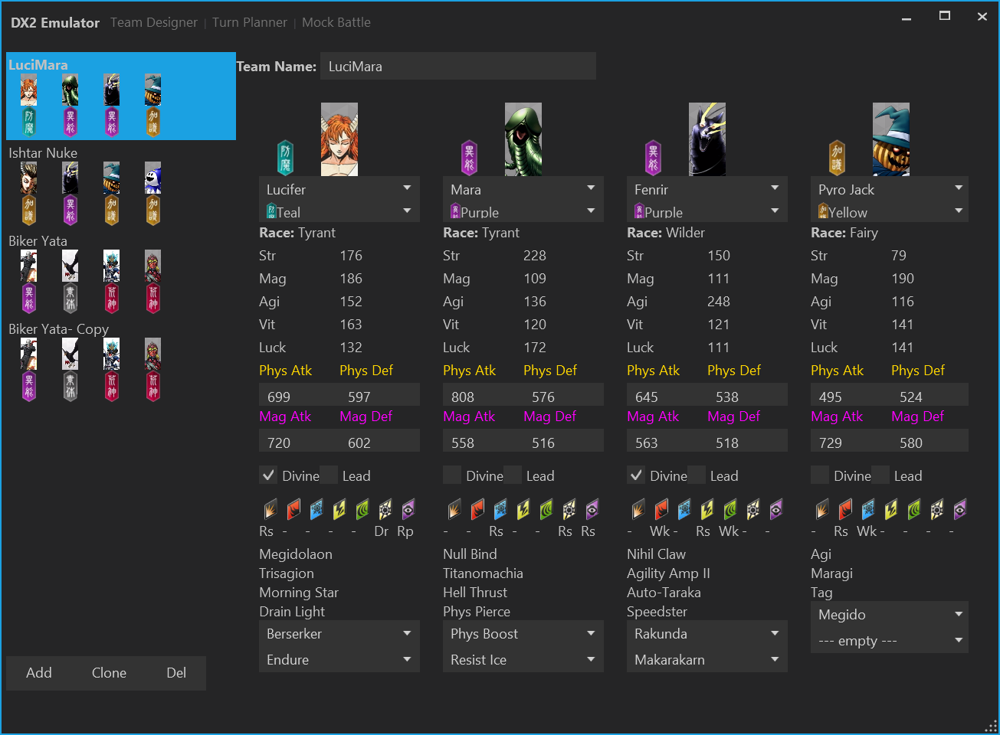

# DxEmulator

Mock turn 1 emulator for DX2.

**Heavy work in progress**, currently only works as a team-builder tool.

**Todo**

- Refactor skill traits
    - use ResistanceData for grants of null/resist/repel/drain
    - use BasicBuff for stat attributions
         - extra crit
         - extra damage
         - extra damage taken
         - extra status chance
         - etc